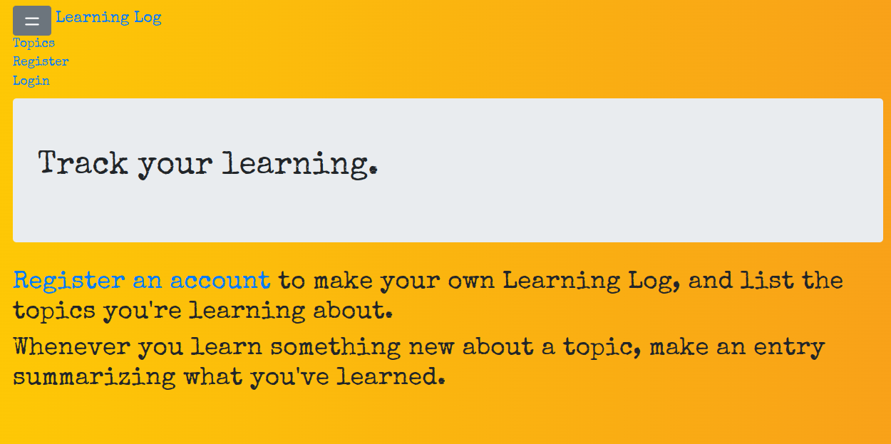

# Learning Log

### Sample web application using Django 4 and bootstrap

## Installation

`pip install -r requirements.txt`

## Run App

-   `python manage.py migrate`
-   `python manage.py runserver`

## Preview

